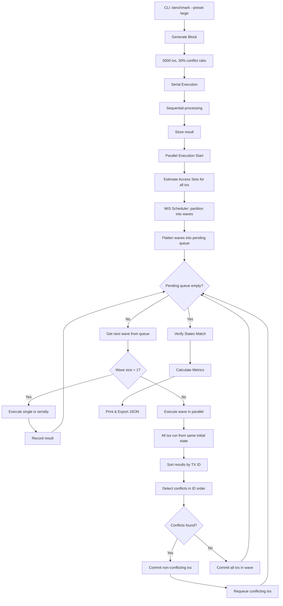

# PEVM Parallel Transaction Scheduler

A parallel EVM transaction scheduler with runtime conflict detection and transaction requeueing.

## Quick Start

```bash
# Build
cargo build --release

# Run benchmark
cargo run --release -- benchmark --preset large

# Run tests
cargo test --release
```

## Execution Flow



## Performance Results

Recent benchmark runs (actual results):

| Preset | Txs  | Serial (ms) | Parallel (ms) | Speedup | Waves | Recall |
|--------|------|-------------|---------------|---------|-------|--------|
| Small  | 100  | 6.3         | 36.3          | 0.17x   | 2     | 1.00   |
| Medium | 1000 | 21.5        | 11.3          | 1.90x   | 3     | 0.91   |
| Large  | 5000 | 1142        | 222           | 5.15x   | 3     | 0.92   |

Note: Small preset shows overhead due to parallel coordination cost exceeding benefit.

## Commands

```bash
# Generate custom block
cargo run --release -- generate \
  --n-tx 1000 \
  --key-space 10000 \
  --conflict-ratio 0.2 \
  --cold-ratio 0.3 \
  --seed 42 \
  --output block.json

# Execute block
cargo run --release -- execute --input block.json --mode parallel

# Benchmark with presets
cargo run --release -- benchmark --preset small
cargo run --release -- benchmark --preset medium
cargo run --release -- benchmark --preset large
```

## Project Structure

```
pevm-opt-2/
├── Cargo.toml
├── Cargo.lock
├── README.md
└── src/
    ├── main.rs                      # Entry point
    ├── lib.rs                       # Library exports
    ├── cli/
    │   └── mod.rs                   # CLI parsing and handlers
    ├── types/
    │   └── mod.rs                   # Core types (Block, Transaction, etc.)
    ├── storage/
    │   ├── mod.rs                   # KVStore trait
    │   └── memory.rs                # In-memory implementation
    ├── evm/
    │   ├── mod.rs                   # Transaction execution
    │   ├── context.rs               # Execution context
    │   ├── gas.rs                   # gas calculation
    │   └── ops.rs                   # Micro-operations (SLoad, SStore, etc.)
    ├── scheduler/
    │   ├── mod.rs                   # Module exports
    │   ├── access_oracle.rs         # Access set estimation
    │   ├── conflict_graph.rs        # Conflict detection
    │   ├── mis.rs                   # MIS scheduling algorithm
    │   └── parallel.rs              # Parallel executor with runtime detection
    ├── generator/
    │   └── mod.rs                   # Synthetic block generation
    ├── metrics/
    │   └── mod.rs                   # Metrics calculation and export
    └── log/
        ├── mod.rs
        └── logger.rs                # Logging utilities
```

## Testing

```bash
cargo test --release

cargo clippy --all-targets --all-features -- -D warnings

cargo fmt --check
```
